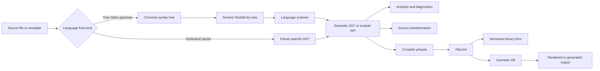

# Cannelle

**Parsing, compilation, and source-transformation infrastructure for the FUDD ecosystem.**

Cannelle is a Haskell library and developer tool for turning source code and
mixed text-and-logic templates into structures that software can inspect,
transform, compile, serialize, and execute.

It brings together:

* Tree-Sitter front ends for several programming languages.
* Language-specific semantic abstract syntax trees.
* A shared combinatorial scanner for traversing Tree-Sitter parse trees.
* Template parsers and compilers.
* Source-analysis and code-generation tools.
* A common compiled representation named `FileUnit`.
* A compact virtual machine for executing compiled template logic.
* Compatibility with the Ginger/Jinja template-processing lineage from which
  Cannelle originated.

Cannelle is not intended to be an end-user application. It is infrastructure
for FUDD applications that need to understand, translate, generate, render, or
execute source-oriented content.

> [!IMPORTANT]
> Cannelle is under active development. Its core architecture is established,
> but its language front ends have different levels of completeness. Public
> APIs, the command-line interface, AST definitions, and compiled formats can
> still change while the package remains in the `0.x` series.

---

## Cannelle at a glance

| Aspect               | Description                                                                      |
| -------------------- | -------------------------------------------------------------------------------- |
| Primary language     | Haskell                                                                          |
| Main purpose         | Parse, analyse, transform, compile, and execute source-oriented content          |
| Parsing technologies | Tree-Sitter, Parsec-derived parsers, Megaparsec, and specialised scanners        |
| Source languages     | Elm, Haskell, PHP, TSX/React, Ruby, Fuddle, Cmm, HTML, and template languages    |
| Template systems     | Jinja/Ginger, Hugo templates, and Templog                                        |
| Structured outputs   | Language ASTs, module APIs, diagnostics, content demands, and compiler IR        |
| Executable output    | `FileUnit` modules interpreted by the Cannelle VM                                |
| User interfaces      | Haskell library and a development-oriented `cannelle` CLI                        |
| Ecosystem role       | Shared syntax, template, compilation, and transformation layer for FUDD software |

---

## Why Cannelle exists

Many applications eventually need to do more with source text than treat it as
an opaque string.

They may need to:

* identify declarations, imports, types, functions, or exported symbols;
* separate literal content from embedded computation;
* preserve the relationship between semantic objects and their source ranges;
* produce summaries of modules without invoking a full compiler toolchain;
* migrate components between languages or presentation technologies;
* compile several template syntaxes into one runtime representation;
* cache or transport compiled definitions;
* generate HTML or source code from a structured model; or
* build higher-level development and knowledge-management tools.

Implementing these capabilities separately in every FUDD application would
duplicate grammar integration, traversal logic, error handling, AST design,
serialization, and runtime machinery.

Cannelle centralises those responsibilities.

Its central design principle is:

> Convert syntax-specific input into stable Haskell structures as early as
> possible, and keep parsing, semantic analysis, transformation, compilation,
> and execution as distinct stages.

---

## Role in the FUDD ecosystem

Cannelle sits between source material and higher-level FUDD applications.

```text
Source files and templates
            │
            ▼
        Cannelle
  parsing · analysis · compilation
  transformation · serialization
            │
            ▼
FUDD applications and development tools
```

Higher-level applications can use Cannelle to obtain structured facts without
embedding a parser for every language they encounter.

Typical uses include:

1. **Source understanding**

   Extract module names, imports, exposed symbols, declarations, signatures,
   definitions, source ranges, and diagnostics.

2. **Technical-documentation support**

   Produce module summaries and cross-references from the same structures used
   by source-analysis tools.

3. **Template processing**

   Parse literal and executable template sections, compile them into a shared
   representation, and render them through a common runtime.

4. **Source transformation**

   Analyse one source representation and generate another, such as the
   experimental TSX-to-Elm path.

5. **Application infrastructure**

   Provide reusable parsing and execution services to systems such as
   EasyWordy and other FUDD tools without coupling those systems directly to
   grammar-specific Tree-Sitter APIs.

Cannelle should therefore be understood as a language and template
infrastructure layer, rather than merely as a template engine.

---

## Architecture

Cannelle supports two broad ingestion paths:

* Tree-Sitter grammars for programming-language source files.
* Dedicated parsers for template languages and specialised source formats.

Both paths progressively convert raw syntax into more useful representations.



### Layer 1 — Grammar integration

Tree-Sitter produces a concrete syntax tree containing both named language
constructs and punctuation-level syntax.

Cannelle wraps the low-level Tree-Sitter interface and converts the resulting
tree into a generic Haskell representation. A node records:

* its grammar symbol;
* its start and end positions;
* its child nodes; and
* the relationship between syntax and original source content.

This isolates most of Cannelle from Tree-Sitter's FFI and grammar-specific
memory representation.

### Layer 2 — Combinatorial scanning

A concrete syntax tree is structurally accurate, but it is not yet a convenient
semantic model.

Cannelle provides a scanner abstraction inspired by parser combinators. A
language implementation can:

* consume expected node symbols;
* inspect the next node without consuming it;
* try alternatives with controlled backtracking;
* parse optional or repeated constructs;
* add contextual error information;
* recover from selected failures; and
* descend into child-node sequences.

The same scanner machinery is reused by several Tree-Sitter language front
ends.

### Layer 3 — Language models

Each language defines the structures relevant to its semantics.

Depending on the language, these may include:

* module definitions;
* import declarations;
* exposed or exported symbols;
* type declarations;
* function signatures;
* function and value definitions;
* expressions and statements;
* source-content demands; and
* semantic diagnostics.

These models deliberately do not attempt to reproduce the Tree-Sitter tree
one-for-one. They retain information useful to downstream applications while
removing grammar-level noise.

### Layer 4 — Analysis and transformation

Once source has been converted into a semantic model, Cannelle can perform
language-aware processing.

Existing examples include:

* resolving the public API of an Elm module;
* detecting duplicate or unresolved exposed declarations;
* analysing TSX/React declarations and components;
* generating Elm-oriented output from analysed TSX;
* inspecting PHP syntax and constants; and
* producing structured Haskell module information.

### Layer 5 — Compilation

Template front ends can convert their semantic structures into compiler
representations and then into a `FileUnit`.

Compilation is intentionally separated into phases so that syntax resolution,
constant collection, control-flow generation, and executable definition
construction do not become one monolithic traversal.

### Layer 6 — Execution

A compiled `FileUnit` can be converted into a VM module and interpreted by the
Cannelle virtual machine.

The VM provides:

* modules and executable definitions;
* call frames;
* typed stack and heap values;
* constant access;
* registers;
* branching;
* arithmetic and comparison operations;
* lists and slices;
* function calls and reductions; and
* an output stream for rendered content.

---

## Capability map

The following table describes the implementation present in the repository. It
is a guide to relative maturity, not a compatibility guarantee.

| Front end or subsystem   | Current capabilities                                                                                                                                                     | Status               |
| ------------------------ | ------------------------------------------------------------------------------------------------------------------------------------------------------------------------ | -------------------- |
| **Jinja/Ginger**         | Parse and render Jinja-style templates with JSON or YAML data through the inherited Ginger engine                                                                        | Compatibility path   |
| **Hugo**                 | Parse template actions and literal content, resolve expressions and control structures, compile definitions into `FileUnit`, serialize output, and exercise VM execution | Active development   |
| **Templog**              | Recognise literal and embedded logic regions, compile expressions and statements, produce `FileUnit`, and execute through the runtime                                    | Active development   |
| **Elm**                  | Parse Tree-Sitter syntax, build a semantic context, resolve module APIs, imports, exposing clauses, types, values, and diagnostics                                       | Active development   |
| **Haskell**              | Parse modules through Tree-Sitter and model module declarations, imports, exposed symbols, signatures, bindings, and selected top-level declarations                     | Active development   |
| **PHP**                  | Parse Tree-Sitter PHP syntax into a specialised context and provide inspection, rendering, and binary-AST support utilities                                              | Active development   |
| **TSX/React**            | Parse TSX, analyse imports, exports, declarations, functions, and JSX-related structures, and generate experimental Elm-oriented output                                  | Experimental         |
| **Ruby**                 | Parse Tree-Sitter Ruby syntax into a language context                                                                                                                    | Experimental         |
| **Fuddle**               | Parse Fuddle source through an Elm-grammar-derived path and construct a Fuddle context                                                                                   | Experimental         |
| **Cmm**                  | Parse Cmm-oriented source using a dedicated Megaparsec parser                                                                                                            | Supporting subsystem |
| **HTML**                 | Parse, render, inspect, and serialize HTML-oriented structures used by other Cannelle facilities                                                                         | Supporting subsystem |
| **FileUnit**             | Store constants, definitions, imports, routing metadata, and executable content in a shared module representation                                                        | Active development   |
| **Cannelle VM**          | Interpret compiled definitions using frames, heap values, opcodes, and output streams                                                                                    | Active development   |
| **Binary serialization** | Read and write a versioned `FileUnit` representation; some value and metadata categories remain incomplete                                                               | Experimental format  |

### What the status labels mean

**Compatibility path**
A capability inherited from the Ginger foundation and retained for existing
Jinja-style processing.

**Active development**
A substantial implementation path exists, but AST coverage, error behaviour, or
interfaces can still evolve.

**Experimental**
The architecture and important implementation pieces exist, but incomplete
constructs, placeholder conversions, or unresolved design questions remain.

**Supporting subsystem**
Infrastructure used by other front ends or transformations rather than a
primary language product.

---

## Building Cannelle

### Prerequisites

Cannelle currently uses Stack and an LTS 22 resolver.

You need:

* GHC compatible with the resolver configured in `stack.yaml`;
* Stack;
* Git;
* a C toolchain suitable for compiling Tree-Sitter grammars; and
* compatible checkouts of the required `haskell-tree-sitter` packages.

### Tree-Sitter package layout

The current `stack.yaml` refers to local packages under a sibling development
workspace resembling:

```text
LocalPkgs/
└── haskell-tree-sitter/
    ├── tree-sitter/
    ├── tree-sitter-elm/
    ├── tree-sitter-haskell/
    ├── tree-sitter-php/
    ├── tree-sitter-ruby/
    └── tree-sitter-tsx/
```

The paths are resolved relative to the Cannelle repository. Reproduce the
configured workspace layout or update the `extra-deps` paths in `stack.yaml` to
point to your local checkouts.

### Build

```bash
git clone https://github.com/whatsupfudd/cannelle.git
cd cannelle

stack build
```

### Run the tests

```bash
stack test
```

### Install the CLI in the current Stack environment

```bash
stack install
```

Or run it without installing:

```bash
stack exec cannelle -- --help
```

The generated `.cabal` file is present for package tooling, but `package.yaml`
is the principal human-maintained package definition.

---

## Command-line interface

The `cannelle` executable is currently a development and inspection tool. It
exposes parser and execution paths used while front ends are being implemented
and tested.

The general form is:

```text
cannelle parse LANGUAGE [OPTIONS] SOURCE
```

Available language selectors currently include:

```text
jinja
hugo
php
templog
tsx
fuddle
haskell
cmm
ruby
elm
```

### Parse an Elm module

```bash
stack exec cannelle -- parse elm src/Main.elm
```

### Parse a Haskell module

```bash
stack exec cannelle -- parse haskell src/Main.hs
```

### Inspect a PHP file

```bash
stack exec cannelle -- parse php public/index.php
```

### Analyse a TSX component

```bash
stack exec cannelle -- parse tsx ui/Dashboard.tsx
```

### Compile a Hugo template

```bash
stack exec cannelle -- \
  parse hugo --output build/dashboard.cannelle templates/dashboard.html
```

Output filenames and extensions are currently caller-defined.

### Render a Jinja template with inline JSON

```bash
stack exec cannelle -- \
  parse jinja --data '{"project":"Cannelle"}' templates/project.html
```

### Render a Jinja template with a data file

```bash
stack exec cannelle -- \
  parse jinja --data-file examples/context.yaml templates/project.html
```

### Enable debug output

```bash
stack exec cannelle -- \
  parse haskell --debug 1 src/Cannelle/Haskell/AST.hs
```

CLI output varies by language. Some modes render final output, some print an
intermediate context or AST, and others invoke experimental compilation or
generation paths.

Applications should normally call the Haskell APIs directly rather than parse
CLI output.

---

## Using Cannelle as a Haskell library

The package currently exposes a broad module surface. New integrations should
prefer the top-level `Parse`, API, compiler, and `FileUnit` modules rather than
depending directly on scanner internals.

### Parse an Elm module API

```haskell
module Main where

import qualified Cannelle.Elm.Parse as Elm

main :: IO ()
main = do
  result <- Elm.parseApi False "src/Main.elm"
  case result of
    Left err -> print err
    Right moduleApi -> print moduleApi
```

`parseApi` performs more than syntactic parsing. It resolves the module-facing
view of declarations, imports, exposing clauses, values, types, and
diagnostics.

To parse source already held in memory, use the corresponding content-oriented
entry point:

```haskell
result <- Elm.parseApiContent False "src/Main.elm" content
```

The filepath remains useful as source identity even when Cannelle does not read
the file itself.

### Parse a Haskell module

```haskell
module Main where

import qualified Cannelle.Haskell.Parse as Haskell

main :: IO ()
main = do
  result <- Haskell.parse False "src/Cannelle/FileUnit/Types.hs"
  case result of
    Left err -> print err
    Right context -> print context
```

For in-memory source:

```haskell
result <- Haskell.parseFromContent False "Example.hs" sourceText
```

The resulting `HaskellContext` contains the module definition, imports,
recognised declarations, and source-content demands.

### Compile a Hugo template

```haskell
module Main where

import qualified Cannelle.Hugo.Parse as Hugo

main :: IO ()
main = do
  result <- Hugo.parse
    "templates/page.html"
    (Just "build/page.cannelle")

  case result of
    Left err -> putStrLn err
    Right fileUnit -> print fileUnit
```

The Hugo path performs several operations:

1. parsing;
2. template-action consolidation;
3. semantic resolution;
4. compiler passes;
5. constant and definition construction; and
6. optional `FileUnit` serialization.

### Read and write a `FileUnit`

```haskell
module Main where

import qualified Cannelle.FileUnit.InOut as FileUnit

roundTrip source destination = do
  decoded <- FileUnit.read source
  case decoded of
    Left err -> print err
    Right unit -> FileUnit.write destination unit
```

The binary format is versioned, but it should currently be treated as an
evolving internal format rather than a long-term stable interchange standard.

---

## Core concepts

### `NodeEntry`

`NodeEntry` is the common Haskell-facing representation of a Tree-Sitter node.

It prevents every language package from having to operate directly on
Tree-Sitter pointers and FFI values. Language scanners instead receive a
normal Haskell tree with source positions and children.

The conversion boundary is approximately:

```text
Tree-Sitter node
      │
      ▼
generic NodeEntry
      │
      ▼
language scanner
      │
      ▼
semantic language value
```

### Scanner combinators

Cannelle's scanner layer applies parser-combinator ideas to an already-created
syntax tree.

A scanner consumes a sequence of nodes rather than a sequence of characters.
This makes it possible to write constructs resembling:

```haskell
moduleP = do
  declaration <- moduleDeclarationP
  imports <- many importP
  declarations <- many declarationP
  pure ...
```

The actual scanners can also inspect nested children, use alternatives,
backtrack over selected attempts, and augment errors with context.

This layer is especially useful when a Tree-Sitter grammar changes its
low-level shape: adaptation can often remain inside the scanner instead of
propagating grammar details throughout the application.

### Semantic ASTs

A semantic AST is intentionally different from a concrete syntax tree.

For example, an import declaration may be represented as one value containing:

* a module name;
* an alias;
* an exposing mode;
* exposed names; and
* source information.

The corresponding concrete syntax may have many intermediary nodes and
punctuation tokens. Those are useful to the parser but often distracting to
documentation, indexing, transformation, and application logic.

### Content demands

Cannelle records selected relationships between semantic elements and original
source content.

A content demand can identify a source range needed later for operations such
as:

* retaining literal text;
* reconstructing an expression;
* displaying a declaration excerpt;
* generating documentation;
* reporting a precise error; or
* applying a transformation without discarding source spelling.

Content demands can be compacted so that repeated source slices are represented
once in a constant pool.

### `FileUnit`

`FileUnit` is Cannelle's common compiled-module representation.

A unit can contain:

* a module name and description;
* a constant pool;
* executable definitions;
* imports;
* routing-related metadata; and
* compiled instructions.

Conceptually, it plays a role similar to a small object file for Cannelle
content:

```text
template AST
     │
     ▼
compiler phases
     │
     ▼
FileUnit
  ├── constants
  ├── definitions
  ├── imports
  ├── routes
  └── instructions
```

The design allows a template front end to stop depending on its original
surface syntax after compilation.

### Cannelle VM

The VM executes the definitions contained in a compiled unit.

It maintains:

* a module table;
* a call stack;
* execution frames;
* registers;
* a typed heap;
* constants;
* the current instruction location;
* runtime status; and
* accumulated output.

This creates a shared runtime target for template languages that would
otherwise require separate evaluators.

The VM is deliberately small and domain-focused. It is not intended to replace
a general-purpose language runtime.

---

## Language front ends

### Elm

The Elm subsystem includes:

* Tree-Sitter parsing;
* semantic context construction;
* module-name handling;
* import and exposing models;
* type and value declarations;
* public API resolution;
* declaration indexing; and
* diagnostics for duplicate or unresolved public names.

The distinction between the raw parsing context and `ModuleApi` is important.
The context describes what Cannelle found in the file; the API represents the
module-facing result after semantic resolution.

### Haskell

The Haskell subsystem is being developed as a lightweight structural
understanding layer for `.hs` modules.

The current model includes constructs for:

* module declarations;
* imports;
* exposed symbols;
* type signatures;
* function bindings;
* simple declaration categories;
* top-level splices; and
* source-content requirements.

It is not a replacement for GHC's parser or type checker. Its purpose is to
provide a practical, Tree-Sitter-based representation for inspection,
summarisation, documentation, and FUDD tooling.

Haskell grammar coverage remains incomplete. Consumers should expect the AST
to expand as additional declaration and expression forms are implemented.

### PHP

The PHP subsystem converts Tree-Sitter syntax into a specialised PHP context
and includes utilities for inspecting and rendering internal structures.

It should currently be viewed as parsing and tooling infrastructure, not as a
complete PHP interpreter.

### TSX and React

The React subsystem parses TSX and analyses constructs such as:

* imports and exports;
* top-level declarations;
* functions;
* component-related structures; and
* JSX-oriented syntax.

It also contains an experimental generation path targeting Elm source.

This subsystem demonstrates Cannelle's intended role in migration and
source-transformation workflows, but the transformation does not yet cover the
full TSX or React language.

### Ruby

Ruby support currently provides Tree-Sitter integration and semantic-context
construction. Conversion into a common executable representation is still
experimental.

### Fuddle

Fuddle support builds on an Elm-grammar-derived parsing path and constructs
Fuddle-specific context values. Compilation into `FileUnit` remains under
development.

### Cmm

The Cmm subsystem uses a dedicated Megaparsec parser rather than Tree-Sitter.
It illustrates that Cannelle's architecture does not require every format to
use the same parsing technology.

The appropriate parser is selected according to the needs of the source
language and the available grammar infrastructure.

---

## Template front ends

### Jinja and Ginger

Cannelle originated from the Ginger project and retains a compatibility path
for Jinja-style templates.

This path can:

* parse templates;
* load JSON or YAML context data;
* evaluate expressions and control structures; and
* render output through the Ginger runtime.

The original Ginger documentation and licensing material remain in the
repository for historical and licensing reference.

### Hugo templates

The Hugo subsystem parses text interleaved with Hugo template actions.

Recognised structures include:

* literal content;
* expressions and pipelines;
* assignments;
* conditionals;
* ranges;
* `with` blocks;
* definitions;
* blocks;
* template inclusion;
* partial inclusion; and
* returns.

The parser output is consolidated and passed through compiler phases that
resolve values, build constants, construct definitions, and emit VM
instructions.

### Templog

Templog explores a FUDD-oriented model in which literal content is combined
with embedded, Haskell-like template logic.

Its model includes constructs such as:

* expressions;
* imports;
* bindings;
* `let` expressions;
* statements;
* unary and binary operations;
* reductions; and
* literal output.

Templog compiles into the same `FileUnit` and VM infrastructure used by other
compiled template paths.

---

## Repository structure

```text
cannelle/
├── cli/
├── doc/
├── src/
│   ├── Cannelle/
│   │   ├── Assembler/
│   │   ├── Cmm/
│   │   ├── Common/
│   │   ├── Compiler/
│   │   ├── Elm/
│   │   ├── FileUnit/
│   │   ├── Fuddle/
│   │   ├── Haskell/
│   │   ├── Html/
│   │   ├── Hugo/
│   │   ├── Jinja/
│   │   ├── Parser/
│   │   ├── PHP/
│   │   ├── React/
│   │   ├── Ruby/
│   │   ├── Templog/
│   │   ├── TreeSitter/
│   │   └── VM/
│   └── Text/
│       └── Ginger/
├── test/
├── package.yaml
├── cannelle.cabal
└── stack.yaml
```

### Important namespaces

| Namespace             | Responsibility                                                                     |
| --------------------- | ---------------------------------------------------------------------------------- |
| `Cannelle.TreeSitter` | Tree-Sitter node conversion, common node types, and scanning interfaces            |
| `Cannelle.Common`     | Shared errors, AST utilities, source-content demands, values, and supporting types |
| `Cannelle.Elm`        | Elm grammar traversal, AST, semantic resolution, and module API                    |
| `Cannelle.Haskell`    | Haskell grammar traversal and semantic module model                                |
| `Cannelle.PHP`        | PHP parsing and inspection-oriented structures                                     |
| `Cannelle.React`      | TSX parsing, analysis, and experimental Elm generation                             |
| `Cannelle.Ruby`       | Ruby parsing and semantic context                                                  |
| `Cannelle.Fuddle`     | Fuddle parsing and model construction                                              |
| `Cannelle.Hugo`       | Hugo template parsing, resolution, and compilation                                 |
| `Cannelle.Jinja`      | Jinja-oriented integration around Ginger                                           |
| `Cannelle.Templog`    | Embedded template-logic parsing, compilation, and execution                        |
| `Cannelle.Compiler`   | Shared compiler structures and compilation support                                 |
| `Cannelle.Assembler`  | Instruction and executable construction support                                    |
| `Cannelle.FileUnit`   | Compiled module types, execution conversion, and binary I/O                        |
| `Cannelle.VM`         | Runtime values, opcodes, frames, engine, and execution state                       |
| `Cannelle.Html`       | HTML parsing, rendering, and serialization support                                 |
| `Cannelle.Cmm`        | Dedicated Cmm parser and model                                                     |
| `Text.Ginger`         | Retained Ginger/Jinja implementation and compatibility modules                     |

The complete list of currently exposed modules is maintained in
`cannelle.cabal`.

---

## Adding or extending a language front end

A typical Tree-Sitter-based language implementation follows these steps.

### 1. Integrate the grammar

Add the grammar package to the package dependencies and configure the
Tree-Sitter language pointer used by the parser entry point.

### 2. Define the semantic model

Create language-specific types for the information downstream applications
actually require.

Avoid copying the grammar tree mechanically. Model declarations, imports,
expressions, definitions, and diagnostics according to their meaning.

### 3. Implement the scanner

Use the common scanner abstraction to translate `NodeEntry` values into the
semantic model.

Keep grammar-symbol names and low-level tree-shape assumptions close to this
layer.

### 4. Provide file and content entry points

A front end should normally expose both:

```haskell
parse :: Bool -> FilePath -> IO (Either CompError Context)
```

and an in-memory equivalent resembling:

```haskell
parseFromContent
  :: Bool
  -> FilePath
  -> ByteString
  -> IO (Either CompError Context)
```

This lets callers parse files directly or use content obtained from databases,
editors, network services, or generated sources.

### 5. Add semantic resolution where required

Some information cannot be determined from one syntax node in isolation.

Examples include:

* resolving exposed names;
* matching signatures with definitions;
* detecting duplicate declarations;
* associating imports with aliases; and
* building a stable module summary.

Keep this work in a resolution or analysis layer rather than embedding it in
the low-level tree traversal.

### 6. Add output paths deliberately

A language front end may expose one or more of:

* a semantic AST;
* a public module API;
* diagnostics;
* documentation structures;
* source generation;
* a transformed AST;
* a compiler representation; or
* a `FileUnit`.

Not every language needs to compile to the Cannelle VM.

### 7. Add fixture-based tests

Tests should cover:

* the smallest valid source;
* representative declarations;
* nested constructs;
* comments and documentation nodes;
* malformed or partially written source;
* grammar nodes not yet supported;
* source locations and content demands; and
* stable semantic summaries.

Tree-Sitter is designed to parse incomplete source. Front ends should preserve
that advantage where practical rather than failing at the first unsupported
construct.

---

## Development guidelines

### Build and test before submitting changes

```bash
stack build
stack test
```

Language changes should also be exercised against representative source files
through the CLI or dedicated integration tests.

### Treat `package.yaml` as the package source

Edit dependency and module declarations in `package.yaml`, then regenerate the
Cabal file through the project's normal Hpack workflow.

Avoid maintaining conflicting package definitions by hand.

### Keep parser concerns separated

Prefer the following boundaries:

```text
Tree-Sitter FFI
    → generic node tree
    → grammar scanner
    → semantic AST
    → resolver or analyser
    → compiler or generator
```

A grammar scanner should not also become a renderer, code generator, and VM
compiler unless the source language genuinely requires those phases to be
inseparable.

### Preserve useful source information

Do not discard source ranges merely because the first consumer does not need
them.

Documentation, diagnostics, refactoring, visualisation, and source-generation
tools often need to reconnect semantic values with their original text.

### Report unsupported constructs explicitly

During active development, an explicit unsupported-node error is more useful
than silently omitting a declaration.

Where tolerant parsing is desirable, preserve an unknown or unresolved value
that includes the source position and grammar symbol.

### Avoid assuming equal maturity

Adding a language name to the CLI does not imply complete grammar coverage,
semantic resolution, compilation, or execution.

Update the capability map when a front end gains or loses a meaningful
capability.

---

## Testing status

The repository includes a Tasty-based test suite. Much of the existing coverage
comes from the project's Ginger ancestry.

As Cannelle's role has expanded, the most valuable additions are now:

* parser fixtures for every supported language;
* semantic AST golden tests;
* module-summary tests;
* malformed and incomplete source tests;
* compiler instruction tests;
* `FileUnit` round-trip tests;
* VM execution tests;
* cross-language generation tests; and
* end-to-end template compilation and rendering tests.

A front end should not be considered mature solely because its parser accepts a
small example. Confidence requires testing the semantic representation and the
downstream operations that depend on it.

---

## Current limitations

Cannelle's architecture is broader than the feature set that is complete today.

Known categories of limitation include:

* incomplete declaration and expression coverage in several language ASTs;
* Tree-Sitter grammar symbols that are not yet handled by language scanners;
* placeholder `FileUnit` conversions in experimental front ends;
* incomplete source-generation cases;
* developer-oriented CLI output rather than a stable machine-readable CLI API;
* a binary `FileUnit` format whose supported value categories are still
  evolving;
* routing and import metadata that are represented more broadly than they are
  currently serialized or executed;
* dependence on locally configured Tree-Sitter package checkouts; and
* test coverage concentrated in the inherited Ginger functionality.

These limitations are reasons to keep the phases and interfaces explicit. They
allow one subsystem to mature without requiring every language front end to
reach completeness simultaneously.

---

## Project direction

Cannelle is evolving toward a reusable platform with three complementary roles.

### 1. Source intelligence

Provide dependable, lightweight structural and semantic information for FUDD
applications.

This includes module summaries, declarations, imports, types, signatures,
definitions, diagnostics, and source references.

### 2. Template compilation

Allow different template syntaxes to share compiler infrastructure, a common
module representation, and a common execution engine.

### 3. Source migration and generation

Support controlled transformations between application technologies and
language representations.

The experimental TSX analysis and Elm generation path is an early example of
this direction.

The long-term value comes from the combination of these roles. The same source
model can support documentation, inspection, transformation, compilation, and
application tooling without reparsing the source independently for every use.

---

## Origin

Cannelle began as a fork of
[Ginger](https://github.com/tdammers/ginger), a Haskell implementation of
Jinja-style templates.

The Ginger implementation remains available under the `Text.Ginger` namespace,
while Cannelle has expanded into a broader parsing, compilation, and
source-transformation system for the FUDD ecosystem.

Historical documentation and original licensing material are retained in the
repository where applicable.

---

## License

See [`LICENSE`](LICENSE) and the retained original licensing files for the
terms that apply to the repository and inherited components.
